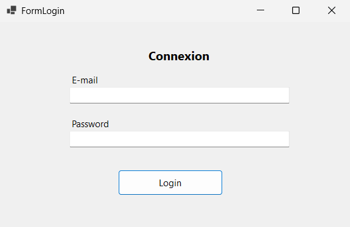
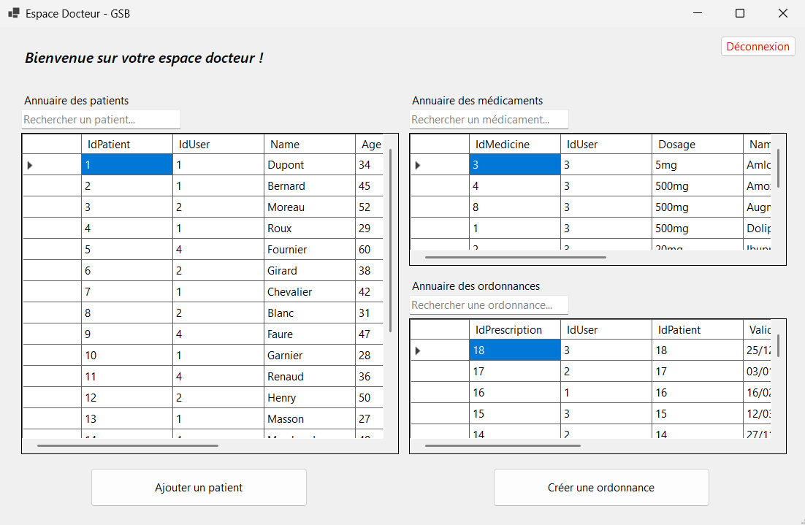
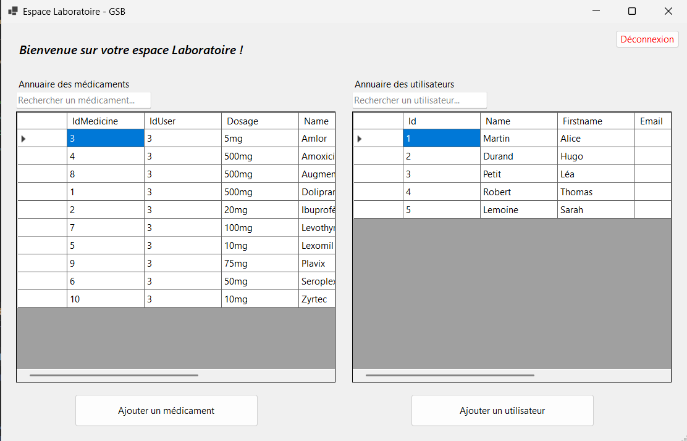
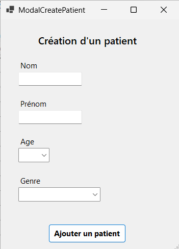
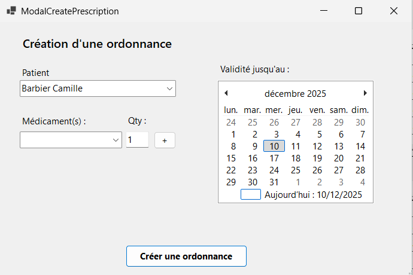
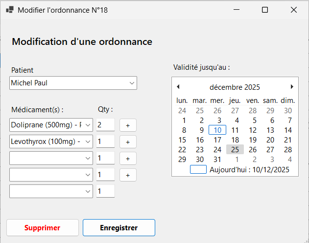
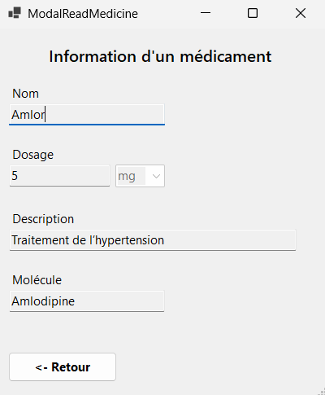
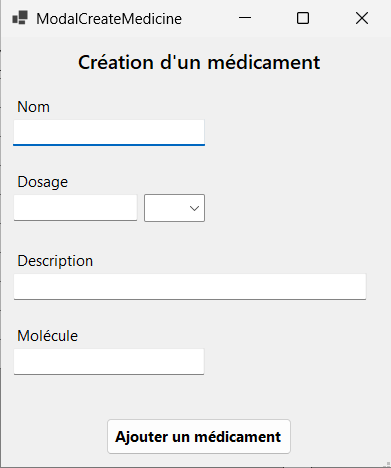
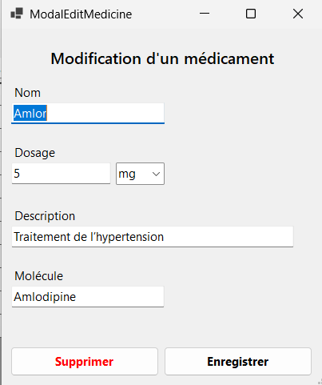
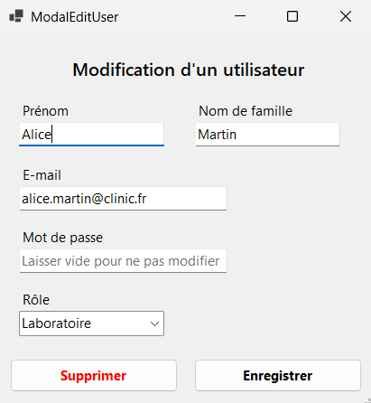

# 🖥️ Documentation des Formulaires (Interface Utilisateur)

Cette section décrit les principaux formulaires Windows (Windows Forms) qui constituent l'interface graphique de l'application.

---

## 🔐 FormLogin

Le point d'entrée de l'application.

### Fonctionnalités
- **Authentification** : Permet aux utilisateurs de se connecter en utilisant leur email et mot de passe.
- **Redirection par Rôle** : Redirige l'utilisateur vers le tableau de bord approprié selon son rôle :
  - **Médecin** (`Role = true`) → `FormDoctor`
  - **Technicien de Labo** (`Role = false`) → `FormLabo`
- **Sécurité** : Utilise `UserDAO.Login` pour vérifier les identifiants par rapport au mot de passe haché dans la base de données.

---

## 👨‍⚕️ FormDoctor

Le tableau de bord pour les Médecins.

### Fonctionnalités
- **Gestion des Patients** :
  - Voir la liste des patients.
  - Rechercher des patients par nom.
  - Créer de nouveaux patients (`ModalCreatePatient`).
  - Voir les détails d'un patient (`ModalDetailsPatient`).
- **Gestion des Ordonnances** :
  - Voir toutes les ordonnances.
  - Créer de nouvelles ordonnances (`ModalCreatePrescription`).
  - Modifier les ordonnances existantes (`ModalEditPrescription` - *Double Clic*).
- **Recherche de Médicaments** :
  - Rechercher et voir les détails des médicaments disponibles (`ModalReadMedicine`).
- **Filtrage** : Filtrage dynamique sur toutes les grilles (Médicaments, Patients, Ordonnances).

### Logique Clé
- `RefreshAllGrids()` : Recharge les données depuis la base de données et applique les filtres actifs.
- `AppliquerFiltre(TextBox tb)` : Filtre les grilles de données en fonction de la saisie utilisateur.

---

## 🧪 FormLabo

Le tableau de bord pour les Techniciens de Laboratoire.

### Fonctionnalités
- **Gestion des Médicaments** :
  - Voir l'inventaire complet des médicaments.
  - Rechercher des médicaments par nom, molécule ou dosage.
  - Ajouter de nouveaux médicaments (`ModalCreateMedicine`).
  - Mettre à jour les détails d'un médicament (`ModalEditMedicine` - *Double Clic*).
- **Gestion des Utilisateurs** :
  - Voir la liste des utilisateurs du système.
  - Créer de nouveaux utilisateurs (`ModalCreateUser`).
  - Modifier les profils utilisateurs (`ModalEditUser` - *Double Clic*).
- **Édition Sécurisée** : Garantit que l'édition n'est tentée que sur des lignes valides pour éviter les plantages.

### Logique Clé
- `RefreshAllGrids()` : Rafraîchit les listes de médicaments et d'utilisateurs.
- `OuvrirEditionSiPossible(...)` : Une méthode générique pour ouvrir en toute sécurité les boîtes de dialogue modales pour l'édition des entités, évitant les `NullReferenceException`.

---

## 📦 Modales (Fenêtres de dialogue)

Les modales sont des formulaires secondaires ouverts par les formulaires principaux pour des tâches spécifiques (Création, Édition, Détails).

### 🩺 Liées à FormDoctor

Ces modales sont utilisées par les médecins pour gérer les patients et les prescriptions.

#### ModalCreatePatient
Formulaire d'ajout d'un nouveau patient (Nom, Prénom, Age, Genre).

#### ModalDetailsPatient
Affiche les informations complètes d'un patient existant et permet sa modification.

#### ModalCreatePrescription
Interface complexe pour créer une ordonnance. Permet d'ajouter plusieurs médicaments avec leurs quantités.

#### ModalEditPrescription
Permet de modifier une ordonnance existante (Changer validité, ajouter/retirer médicaments).

#### ModalReadMedicine
Affiche les détails d'un médicament en lecture seule pour information.

### 🔬 Liées à FormLabo

Ces modales sont utilisées par les techniciens de laboratoire pour gérer le stock et les accès.

#### ModalCreateMedicine
Formulaire d'ajout d'un nouveau médicament au stock.

#### ModalEditMedicine
Permet de modifier les propriétés d'un médicament (Nom, Dosage, etc.).

#### ModalCreateUser
Formulaire de création d'un nouvel utilisateur (Médecin ou Labo).

#### ModalEditUser
Permet de modifier un utilisateur (Changer rôle, email, ou réinitialiser mot de passe).

